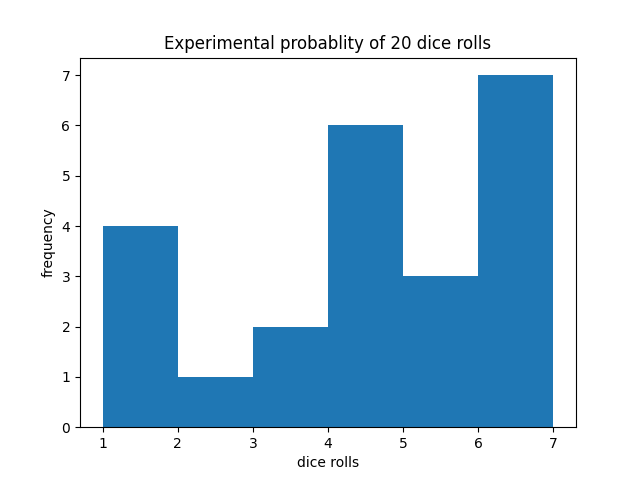

## What we'll be doing

We'll be making a serverless application which can take information from a HTTP request and generate a histogram. This is a basic implementation which is completely open for extension. Optional extensions include being able to add a legend to the plot, or allowing new types of graphs such as a scatter plot or pie chart.

## Prerequisites

- [Pipenv](https://pypi.org/project/pipenv/) - for simplified dependency management
- The [Nitric CLI](https://nitric.io/docs/installation)
- An [AWS](https://aws.amazon.com), [GCP](https://cloud.google.com) or [Azure](https://azure.microsoft.com) account (_your choice_)

## Getting started

We’ll start by creating a new project for our API.

```bash
nitric new
```

Create a project, name it and select your preferred starter template.

```bash
? What is the name of the project? histogram-api
? Choose a template: official/Python - Starter
```

Next, open the project in your editor of choice.

```bash
> cd histogram-api
```

Make sure all dependencies are resolved using Pipenv:

```bash
pipenv install --dev
```

Starting from scratch in the `hello.py` function file, lets start by importing and defining our api.

```python
from nitric.resources import api
from nitric.application import Nitric

mainApi = api("main")

Nitric.run()
```

We can then define our api route which will accept the histogram data to then be returned as an image.

```python
from nitric.resources import api
from nitric.application import Nitric
import matplotlib as plt

mainApi = api("main")

@mainApi.get("/histogram")
async def create_histogram(ctx):
  pass

Nitric.run()
```

The route will be registered for a GET method so that it is a link that can be embed. For example, once the api is complete, it will be able to be used in situations like:

```html

```

We can then write the logic for creating the histogram from the request. As seen in the above url, there are 4 query parameters that we want a user to be able to configure, the data, y-label, x-label, and title.

```python
@mainApi.get("/histogram")
async def create_histogram(ctx):
  # Extract the comma-delimited data and split it into array
  data = ctx.req.query.get("data")[0].split(',')

  # Get the optional histogram labels
  xlabel = ctx.req.query.get("xlabel")
  ylabel = ctx.req.query.get("ylabel")
  title = ctx.req.query.get("title")

  try:
    data = [int(d) for d in data]
    data.sort()
  except ValueError:
    # If casting to int throws error, return a bad request status code
    ctx.res.status = 400
    return

  plt.hist(x=data)

  # The title, ylabel and xlabel are all optional so check they exist before using them.
  plt.title(title[0] if title is not None else "")
  plt.xlabel(xlabel[0] if xlabel is not None else "")
  plt.ylabel(ylabel[0] if ylabel is not None else "")
```

We will also want to make the bins for our histogram equal to the range of the histogram. For this we will use numpy, as it will support using floats as well as integers.

```bash
pipenv install numpy
```

```python
import numpy as np

...
# Get the number of bins as the x-range of the data
plt.hist(x=data, bins=np.arange(min(data), max(data) + 2, 1))
...
```

At this point the plot will be created, however, nothing but a 200 status will be returned to the user. To actually return the data as an image to the user, we will need to first get the image data.

```python
import io

with io.BytesIO() as buffer:  # use buffer memory
    plt.savefig(buffer, format='png')
    buffer.seek(0)
    ctx.res.body = buffer.getvalue()
    ctx.res.headers = { 'Content-Type': 'image/png' }
```

This will save the plot as a png and store it in the buffer. We can then return it in the body of our response and set the header to the correct content type. At the end we want to reset the plot. The plot not being cleared will only effect local reruns, as once deployed the state is ephemeral.

```python
with io.BytesIO() as buffer:  # use buffer memory
    plt.savefig(buffer, format='png')
    buffer.seek(0)
    ctx.res.body = buffer.getvalue()
    ctx.res.headers = { 'Content-Type': 'image/png' }

plt.close()
```

We can now test it in our browser. First start the Nitric server:

```bash
nitric start
```

Then run our python application:

```bash
pipenv run dev
```

This will register our api and routes with the Nitric server ready for local testing. Open up a browser or HTTP client and use the URL:

`http://localhost:4001/histogram?data=1,1,2,2,2,3,3,3,3,5,6,4,5,3,2,6,6,6,5,4&ylabel=Frequency&xlabel=Outcome&title=Outcome%20of%2020%20dice%20rolls`

Browsing to this URL should produce a histogram like:



## Deploy to the cloud

Setup your credentials and any other cloud specific configuration:

- [AWS](/docs/reference/providers/aws)
- [Azure](/docs/reference/providers/azure)
- [GCP](/docs/reference/providers/gcp)

Create a stack - a collection of resources identified in your project which will be deployed.

```bash
nitric stack new
```

```
? What do you want to call your new stack? dev
? Which Cloud do you wish to deploy to? aws
? select the region us-east-1
```

You can then deploy using the following command:

```bash
nitric up
```

To undeploy run the following command:

```bash
nitric down
```
