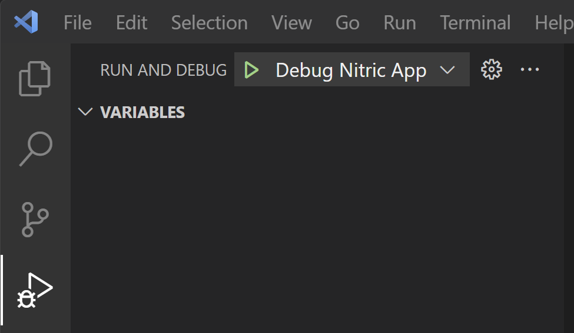

Debugging is a critical skill for any developer, as it allows them to identify and fix errors in their code. Without debugging, developers would be unable to troubleshoot issues and improve the performance and functionality of their applications.

Fortunately, Nitric provides a powerful solution for debugging that can be used with a wide range of programming languages and code editors. By leveraging the Nitric local dashboard, developers can quickly and easily identify issues in their code and use their favorite language debugger and code editor to make the necessary fixes. This streamlined process can save developers time and frustration, allowing them to focus on building high-quality applications that meet the needs of their users.

Here's a quick video demonstrating how to use Nitric's local dashboard for debugging with VS Code:

<div class="video-container">
    <iframe src="https://www.youtube-nocookie.com/embed/dzZu84xr6cY" title="Debugging with Nitric Local Dashboard" frameborder="0" allow="accelerometer; autoplay; clipboard-write; encrypted-media; gyroscope; picture-in-picture; web-share" allowFullScreen></iframe>
</div>

## VS Code Debugging with Nitric Templates

### TypeScript and JavaScript

Nitric's JavaScript and TypeScript templates include pre-made launch.json files that enable seamless debugging in VS Code.

Once you have created your new Nitric project, your directory structure will resemble the following:

```
project-root/
├── .vscode/
│   └── launch.json
├── nitric.yaml
├── ...
```

Before running the debugger, it is necessary to install the project's dependencies. In the case of TypeScript or JavaScript, you can do this by running:

```bash
# yarn
yarn install

# Or npm
npm install

# or pnpm
pnpm install
```

Then go to the Run and Debug tab and click the start debugging button (The Green arrow) for `Debug Nitric App`:



To learn more about debugging with VS Code, you can explore [additional resources and documentation](https://code.visualstudio.com/docs/editor/debugging).

### Other languages

In the future, we might include debugging guides for more languages, and it's likely that they will be unique enough to require their own guides.

## Next Steps

Take a look at our other guides for some inspiration on what to build next!

- [Nitric and Supabase](./nitric-and-supabase.md)
- [Nitric and GraphQL](./graphql.md)
- [APIs with PlanetScale, Prisma and Nitric](./serverless-api-with-planetscale-and-prisma.md)
