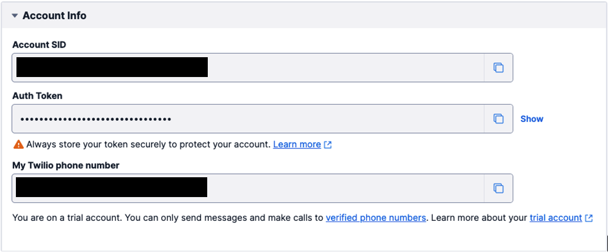

## What we'll be doing

In this guide we'll use the Nitric Framework with [Twilio](https://twilio.com) to build a serverless API that can send SMS to users. This won't include a frontend, however you can look at how to integrate a Nitric API in one of our other comprehensive [guides](https://nitric.io/docs/guides/api-with-nextjs).

## Getting Started

### Create a Project

Create a new project using:

```
nitric new
? What is the name of the project? nitric-twilio
? Choose a template: official/TypeScript - Starter
? Glob for the function handlers? functions/*.ts
```

This will scaffold the project ready for defining your API.

### Create a Twilio Account

To integrate with Twilio, it's important to create a Twilio account. If you don't already have an account, there's an option to start a free trial [here](https://www.twilio.com/try-twilio). This trial doesn't ask for any payment details and provides a decent amount of free credits.

Once you've gone through the account creation and verification, you'll arrive at the dashboard. There is a section which contains the important API credentials. These are used to connect to the API so keep them in mind.



## Create the Messenger Class

The messenger class acts as a helper wrapper for sending text messages. It accepts the account SID and the auth token and creates a client. This client is then used in the single method `send` which accepts a text message object and creates it.

```ts
// common/messenger.ts

import twilio, { Twilio } from 'twilio';

class Messenger {
  private client: Twilio;

  constructor(twilioAccountSID: string, twilioAuthToken: string) {
    this.client = twilio(twilioAccountSID, twilioAuthToken);
  }

  async send(text): Promise<string> {
    try {
      const message = await this.client.messages.create(text);
      return `${message.dateCreated}: Successfully sent text message`;
    } catch (err) {
      return `An error occured: ${err}`;
    }
  }
}

export default Messenger;
```

You will need to add the twilio module using your preferred package manager.

```
npm install twilio
```

## Create the API

For the API we will have a single POST route `send`. This done by creating an API resource using the Nitric SDK and defining a new route.

```ts
// functions/text.ts

import { api } from '@nitric/sdk';

const textApi = api('text');

textApi.post('/send', async (ctx) => {});
```

The next step is pulling the environment variables in and constructing our messenger. We will use the `dotenv` module.

```
npm install dotenv
```

We can create a `.env` file in root of the project with the twilio API information that's sitting on your Twilio dashboard.

```
TWILIO_ACCOUNT_SID=14f7e9a0b95d11ec84220242ac120002
TWILIO_AUTH_TOKEN=6f20cb2ae2764be8b615d6fad4accec4
TWILIO_PHONE_NUMBER=+1234567890
```

The `dotenv.config` call will load the variables from the `.env` file into the `process.env` object. You can then use the variables to construct the messenger.

```ts
// functions/text.ts

import { api } from '@nitric/sdk';
import Messenger from '../common/messenger';

require('dotenv').config();

const textApi = api('text');

const twilioAccountSID = process.env.TWILIO_ACCOUNT_SID;
const twilioAuthToken = process.env.TWILIO_AUTH_TOKEN;

textApi.post('/sendMessage', async (ctx) => {
  const messenger = new Messenger(twilioAccountSID, twilioAuthToken);
});
```

We'll fill in the logic for the route. First, pull the data from the POST request. This data will look like so:

```json
{
  "to": "+16505130514",
  "message": "Test Message from Twilio!"
}
```

And can be extracted from the context like this:

```ts
const { to, message } = ctx.req.json();
```

Secondly, convert this data to an SMS object:

```ts
{
  to,
  body: message ?? '',
  from: process.env.TWILIO_PHONE_NUMBER
}
```

Finally, putting all these components all together, we get a functional text messaging endpoint ready for testing:

```ts
// functions/text.ts

textApi.post('/send', async (ctx) => {
  const messenger = new Messenger(twilioAccountSID, twilioAuthToken);

  const { to, message } = ctx.req.json();

  const resp = await messenger.send({
    to,
    body: message ?? '',
    from: process.env.TWILIO_PHONE_NUMBER,
  });

  ctx.res.body = resp;

  return ctx;
});
```

## Test the API

This API can easily be tested using the local Nitric dev environment. This is started with the following command:

```
npm run dev
```

> _Note:_ the `dev` script in the template starts the Nitric Server using `nitric start` and runs your functions.

We can then use a tool like `postman` or `curl` to test the endpoint.

```
curl -X POST -d '{"to":"+16505130514", "message": "Test Message from Twilio!"}' http://localhost:4001/send
```

If everything has been set up correctly, and the 'to' field on the JSON request body is replaced with a phone number you own, you will get a text that looks something like:

```
Sent from your Twilio trial account -
Test Message from Twilio!
```

Thats it! If you want to deploy the API you can using our [deployment](https://nitric.io/docs/getting-started#deploying-the-app) docs. If you want to attach a frontend to the application so its a bit more user friendly, you can use any framework you want or follow our [Next.js guide](/docs/guides/api-with-nextjs)
